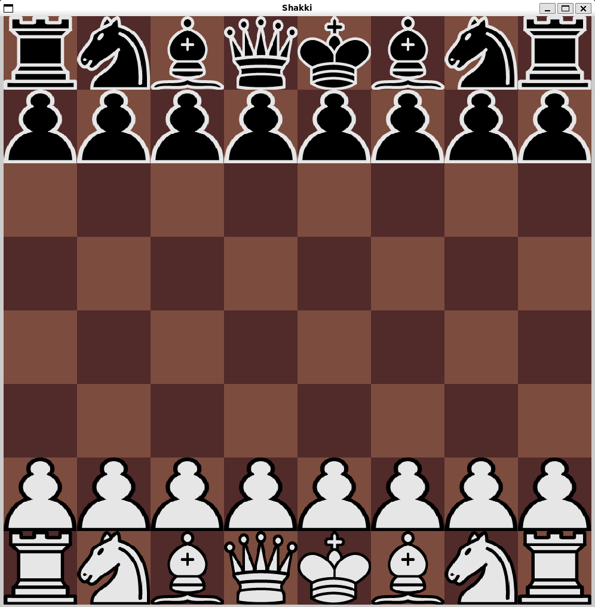
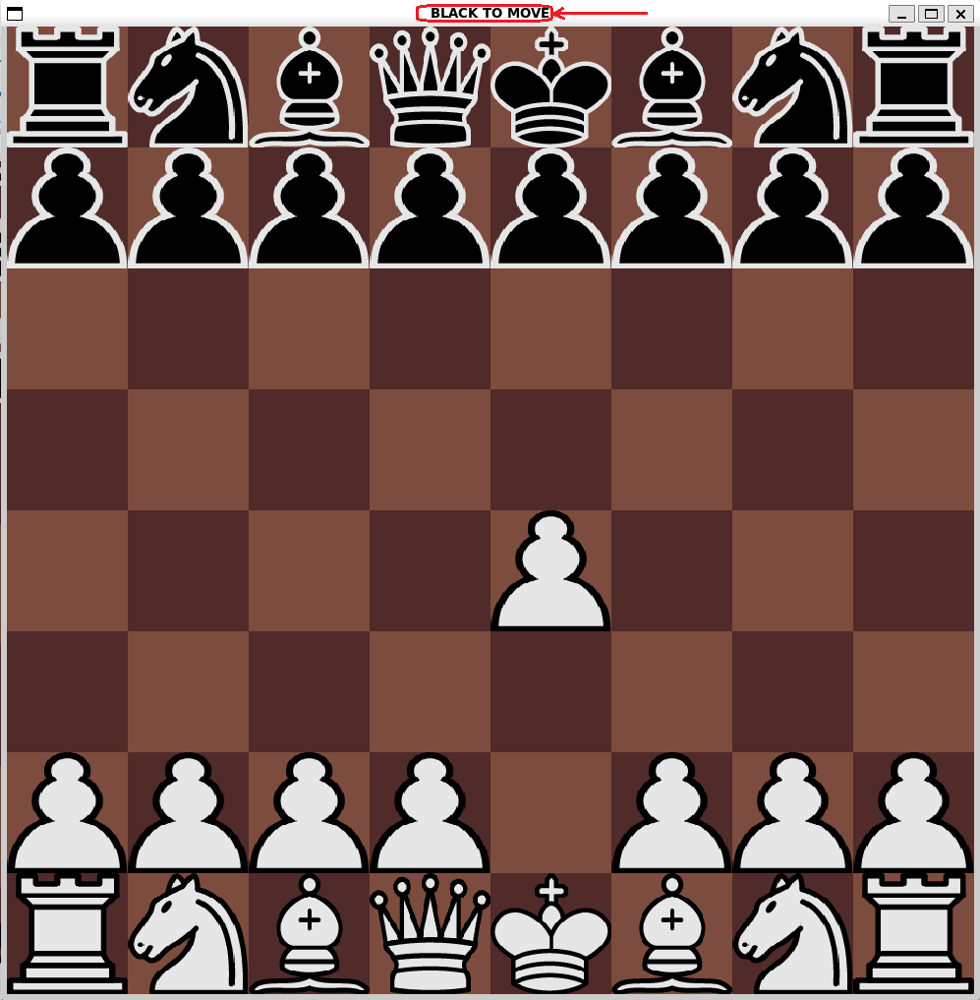
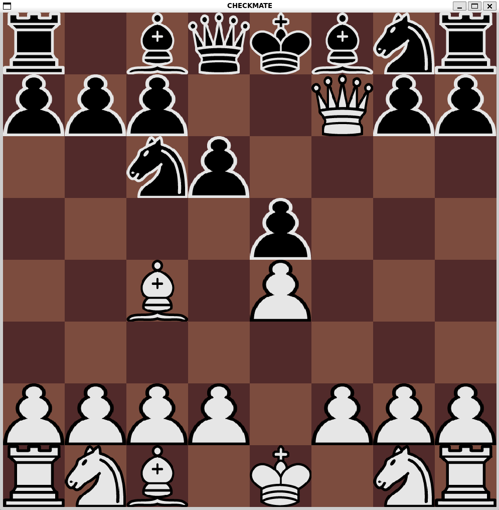

# Käyttöohje

## Ohjelman käynnistäminen

Asenna ensin poetry komennolla: poetry install 
Sovelluksen voi nyt käynnistää komennolla poetry run invoke start 
Sovellus käynnistyy suoraan pelinäkymään(kuvattu alla), on valkean siirtovuoro.  
 
### Siirron tekeminen
Voit jokaisella siirrolla valita, haluatko itse  tehdä siirron, vai haluatko tekoälyn tekevän siirron. 
#### Tekoäly

Välilyöntiä painamalla saat tekoälyn tekemään siirron. Odota pieni hetki, pian jokin nappula liikkuu laudalla, ja pelin ikkunan teksti muuttuu.
#### Pelaaja

Jos haluat itse tehdä siirron, vie hiiren osoitin haluamasi nappulan kohdalle, paina hiiren vasen näppäin pohjaan, liikuta hiiren osoitin ruutuun, johon haluat liikuttaa nappulan, päästä irti hiiren vasemmasta näppäimestä. Jos yritit tehdä laittoman siirron, mitään ei tapahdu, ja konsoliin tulostuu virheviesti. Jos siirron tekeminen onnistui, nappula liikkuu valitsemaasi ruutuun ja pelin ikkunan teksti muuttuu.

  
Yllä on esimerkki tilanteesta, jossa valkea on liikuttanut kuninkaan edessä olevaa moukkaa 2 ruutua eteenpäin. Punaisella ympyröitynä on muuttunut ikkunan teksti. Teksti kertoo aina, mikä on pelin tilanne, kumpi väri liikkuu seuraavaksi.  
  
Yllä on esimerkki tilanteesta, jossa peli on päättynyt shakkimattiin. Pelin loppuessa sulje ikkuna klikkaamalla oikeasta yläkulmasta löytyvästä ruksista. Halutessasi voit seurata uudelleen pelin käynnistysohjeita pelataksesi uudestaan.