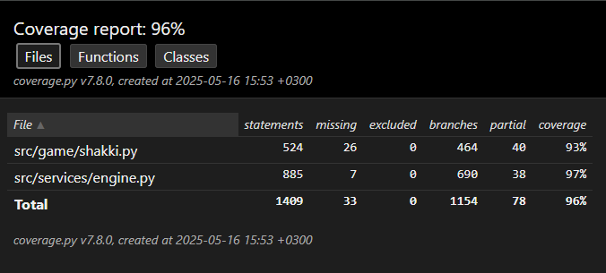

# Testausdokumentti

## Käyttöliittymä

Käyttöliittymä on testattu manuaalisesti. Käyttäjä tai tekoäly eivät voi tehdä laittomia siirtoja. Peli päättyy halutusti pattiin ja mattiin, tai jos sama asema toistuu kolmesti. Sovelluksen ajaminen onnistuu käyttöohjeen mukaisesti.

## Tekoäly

Tekoälylle on kirjoitettu yksikkötestejä toiminnallisuuden ja tukevien funktioiden testaamiseen. On myös testattu, että algoritmi palauttaa oikeat arvot ja siirrot tietyissä asemissa, joissa etukäteen tiedetään kokoelma hyväksyttäviä siirtoja, ja/tai parhaan siirron tuottaman arvo tai arvon suuruusluokka. Näin on myös todettu algoritmin löytävän ja pelaavan nopeimman mahdollisen shakkimatin laskentasyvyydellä. Tulokset on testien lisäksi todennettu ajammalla shakkipeli näillä asemilla, ja havaittu tekoälyn pelaavan halutulla tavalla. Heuristiikkafunktiolle ja siirtojen järjestämisfunktiolle on niin ikään kirjoitettu testit strategisilla syötteillä niiden oikeellisuuden varmistamiseksi.

## Shakki

Shakkipelille on kirjoitettu kattava määrä yksikkötestejä varmentamaan, että pelin logiikka toimii halutulla tavalla.

## Testikattavuus

Ollaan saavutettu hyvä testikattavuus, kaikki projektin toiminnallisuus on testattu ja todettu toimivaksi. Alla testikattavuusraportti projektin pelilogiikasta ja tekoälystä.   
