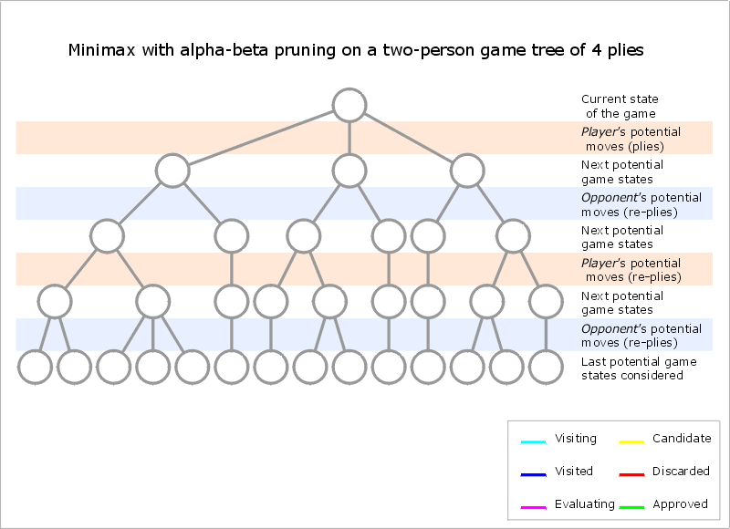

# Toteutusdokumentti

## Ohjelman yleisrakenne

### Tekoäly

Ohjelman ydin on tekoäly shakkipelille, joka perustuu minimax-algoritmiin alpha-beta-karsinnalla. Algoritmi löytää ja pelaa aina parhaan siirron laskentasyvyydellä. Näin ollen algoritmi löytää aina matin laskentasyvyydellä. Useamman matin löytyessä laskentasyvyydeltä, algoritmi pelaa siirron, jolla se saa matitettua vastustajan nopeiten. Samoin joutuessaan huonoon tilanteeseen, algoritmi yrittää pitkittää peliä, ja valitsee siirrot joilla tulee hitaimmin matitetuksi.  Minimax algoritmi on tyypillinen vuoropohjaisen nollasummapelin algoritmi; maksimoija yrittää tehdä siirtoja, joilla pelitilanteen heuristinen arvo olisi mahdollisimman suuri, minimoija yrittää tehdä siirtoja, joilla heuristinen arvo olisi mahdollisimman pieni.  Alpha-beta karsinnan tarkoituksena on tehostaa pelipuun läpikäymistä eliminoimalla haarat, jotka eivät voi tuottaa tarpeeksi hyvää heuristista arvoa tullakseen valituksi.

#### Algoritmin toiminta

Olkoon siirtovuorossa oleva pelaaja maksimoija, olkoon laskentasyvyys D:  <ol>
<li>Maksimoija tekee siirtolistansa päällimmäisen siirron, muokkaa pelilautaa, ja kutsuu minimoijan tekemään oman siirtonsa laskentasyvyydellä D-1</li>
<li>Minimoija tekee siirtolistansa päällimmäisen siirron, muokkaa pelilautaa, ja kutsuu maksimoijan tekemään oman siirtonsa laskentasyvyydellä (D-1)-1</li>
 ... Rekursiiviset kutsut vievät jäljellä olevien kutsujen määrää D lähemmäksi nollaa ...  <li>
Jos päästään pelitilanteeseen, jossa peli päättyy mattiin tai pattiin, funktio palauttaa ennalta määritetyn heuristisen arvon. Muussa tapauksessa saavutettaessa laskentasyvyys D = 0, heuristinen funktio arvioi pelitilanteen ja palauttaa sille sopivan arvon. </li> ... Algoritmi laskee ja palauttaa siirtojen arvoja, lähestytään alkuperäistä rekursiivista kutsua ...  
<li>Minimoija tasolla (D-1) on käynyt läpi kaikki siirtojensa tuottamat pelipuut, ja palauttaa sen siirron (ja arvon), jonka tuottaman pelipuun heuristinen arvo oli mahdollisimman pieni</li>
<li>Nyt maksimoijan siirrolle, joka aloitti rekursiiviset kutsut, on saatu heuristinen arvo ja siirtolistan päällimmäisen siirron tuottama pelipuu on käsitelty. Jos siirron heuristinen arvo on suurempi kuin alpha, siirto tallennetaan parhaana siirtona ja alphan arvoksi asetetaan siirron tuottama arvo. Alphan arvon muutos vaikuttaa seuraavaksi käsiteltävien siirtojen pelipuiden läpikäymiseen nopeuttavasti</li><li>
Jos siirtolistassa on jäljellä käsittelemättömiä siirtoja, suoritetaan kohta 1 uudestaan seuraavalle siirrolle. Muuten jatketaan kohtaan 7</li>
<li>Kaikki siirrot, ja siten myös kaikki mahdolliset pelipuut on käyty läpi, maksimoija pelaa sen siirron laudalle, jonka aiheuttama minimoitu ja maksimoitu pelipuu tuotti suurimman heuristisen arvon.</li></ol>  

[linkki graafin alkuperäiselle sivulle](https://en.wikipedia.org/w/index.php?curid=23148439), auktorina Maschelos

#### Siirtojen järjestäminen

Siirrot on järjestetty suhteellisen yksinkertaisesti: syövät siirrot päällimmäisinä, pieniarvoisten nappuloiden siirrot ensin; loput siirrot nappuloiden arvojärjestyksessä, arvokkaimpien nappuloiden siirrot ensin.

#### Heuristinen funktio

Heuristinen funktio arvioi laudan pelitilannetta. Funktiota kutsutaan useasti algoritmin suorituksen aikana, jonka takia funktiosta on yritetty tehdä mahdollisimman yksinkertainen. Heuristinen funktio saa tiedot kaikista nappuloista ja niiden sijainneista, sekä materiaaliarvon - valkean ja mustan nappuloiden arvon erotuksen. Funktio laskee kaikkien nappuloiden sijaintien tuottamat lisäarvot yhteen kullekkin nappulalle erikseen määritetyllä bitmapilla, ja lisää tähän parametrina saadun materiaaliarvon.

### Käyttöliittymä

Käyttöliittymä on tehty pygamella. Graafisessa esityksessä käytetyt kuvat ovat JohnPablokin tekemät ja haettu [täältä](https://opengameart.org/content/chess-pieces-and-board-squares). Pelissä voi joka siirtovuorolla valita pelaako itse siirron, vai pelaako tekoäly. Tekoäly on asetettu sovelluksessa laskentasyvyydelle 3; tällöin tekoäly tekee siirron riittävän nopeasti, eikä käyttäjä joudu juurikaan odottelemaan. Pelilogiikka on tehty luokkaan Shakki. 

#### Shakki

Ohjelmalle itse kirjoitettu shakkipeli. Peli sisältää sotilaan korotuksen, peli ei sisällä tornitusta tai ohestalyöntiä. Pelissä ei voi tehdä laittomia siirtoja. Matti, patti ja kolminkertainen aseman toistuminen lopettavat pelin.

## Aikavaativuus

Kunkin siirron valinnan aikavaativuus parhaimmillaan on O($\sqrt{n^d}$) ja huonoimmillaan O($n^d$), missä n on siirtojen määrä ja d laskentasyvyys.
Lähemmäksi parasta aikavaativuutta päästään, mitä nopeammin kullakin iteraatiolla löydetään paras siirto, sillä voidaan karsia useampia pelipuun oksia käymättä läpi kaikkia haaroja.

## Parannusehdotukset

Peliin voisi lisätä tornituksen ja ohestalyönnin. Käyttöliittymää voisi parantaa. Jos algoritmin saa tehokkaammaksi paremmalla siirtojen järjestyksellä ja täysin dynaamisella tukevien listojen päivityksellä, projekti saattaisi hyötyä iteratiivisen syvenemisen lisäämisestä.

## Laajojen kielimallien käyttö

Projektissa ei ole käytetty laajoja kielimalleja.

## Muut lähteet

[Wikipediasta](https://en.wikipedia.org/wiki/Alpha%E2%80%93beta_pruning) löytyi pseudokoodi alpha-beta-karsinnalle. 
[Chessprogramming wikistä](https://www.chessprogramming.org) löytyivät bitmapit nappuloille, ja idea kuninkaan bitmapin vaihdolle loppupeliä varten. Lähteestä olisi voinut löytyä vaikka mitä projektin avuksi, harmikseni löysin sivuston vasta projektin loppupuolella. Graafisen käyttöliittymän tekemisessä auttoi [vuoden 2024 python mooc](https://programming-24.mooc.fi/part-14/1-game-project), ja apua pygamen käyttöön löytyi [pygamen dokumentaatiosivuilta](https://www.pygame.org/docs/).